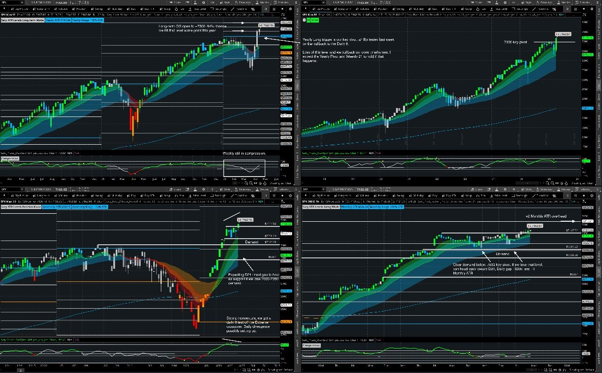

# Weekly Plan — Week of April 27, 2026

> Source: Saty Mahajan weekly note 4/26/2026
> SPX last close (note time): **7185.08**

## TL;DR

- **Bias:** bullish, momentum still up. Long-term GG open to **~7300** (64% chance hit sometime this year).
- **Heavy macro week.** 5 of the 7 megacaps report. FOMC Wednesday. Powell's last presser before likely chair handoff in June.
- **Key pivot 7300** (Yearly Long Trigger). Tested last week on the pullback to Daily 8.
- **Demand 7000–7050.** If lost → Daily 21, then Daily Gap ~6800 (= +1 Monthly ATR floor).
- **Daily divergence possibly setting up** off the Daily Extreme PO crossover. Worth respecting.
- US-Iran tension still in the background — talks failed over the weekend.

---

## Key Levels (SPX)

| Level | Role | Notes |
|---|---:|---|
| **7300** | Yearly Long Trigger / GG target | Long-term GG open. 64% reach prob. |
| **7185** | Spot at note time | — |
| **7000–7050** | **Demand** (key) | Held last week. If lost → weakness regime. |
| ~6900 | Daily 21 EMA | First support if 7000 fails. |
| **~6800** | Daily Gap / +1 Monthly ATR | Next gap for support. |
| Higher | +2 Monthly ATR overhead | Stretch target. |

---

## Catalyst Calendar

| Day | Time (ET) | Event |
|---|---|---|
| **Tue 4/28** | 10:00am | Consumer Confidence |
| **Wed 4/29** | 02:00pm | **FOMC Statement & Rate Decision** (FedWatch 99.6% no cut) |
| | 02:30pm | **Powell Press Conference** — final before likely chair replacement in June |
| | AH | **Earnings: MSFT, AMZN, META, GOOGL** |
| **Thu 4/30** | 08:30am | GDP, PCE, Unemployment Claims |
| | 09:45am | Chicago PMI |
| | AH | **Earnings: AAPL** |
| **Fri 5/1** | 09:45am | S&P PMI |
| | 10:00am | ISM Manufacturing |

Calendars: [investing.com](https://investing.com/economic-calendar) · [forexfactory](https://forexfactory.com/calendar) · [marketwatch](https://www.marketwatch.com/economy-politics/calendar)

---

## Structural Read (Saty)

- **Long-term:** GG open to **~7300**, 64% reach prob this year. Long-term framework remains bullish.
- **Weekly:** still in **compression** — primed for expansion if a catalyst kicks it.
- **Daily:** strong momentum. Daily 8 test of Extreme PO crossover happened. **Daily divergence possibly setting up** — keep on radar.
- **Position/Quarterly:** D21 is the next gap target if 7000–7050 demand fails.
- **Swing/Monthly:** clear demand below at 7000. Loss → D21 → Daily Gap ~6800 → +1 Monthly ATR.

---

## Game Plan by Scenario

### Bull case (base)
- Demand 7000–7050 holds.
- Earnings beats from MSFT/META/GOOGL/AMZN (Wed AH) + AAPL (Thu AH) propel toward 7300.
- **Setups to favor:** Bilbo GG Bull (1h PO High+Rising), call-trigger 3m close on directional days, GG entries (immediate-at-trigger or 1h EMA21 pullback).
- **Avoid:** chasing extended moves into Wed 2pm or earnings AH windows.

### Bear case (pullback)
- 7000–7050 demand breaks.
- Likely catalyst: hawkish Powell tone, earnings miss from a megacap, US-Iran escalation.
- **Setups to favor:** Bilbo GG Bear (1h PO Low+Falling — strongest cohort, 90.3%), call-to-put-reversal if morning fades PDC, gg-invalidation as risk rule.
- **Targets:** D21 (~6900) → Daily Gap (~6800).

### Chop case
- Macro paralysis around FOMC.
- **Setups to favor:** Trigger Box directional only after 1hr hold confirmation. **Avoid raw Bilbo Box breakouts and any 0DTE entries 30 min before / after FOMC.**
- Use gg-chop-zone filter to disqualify low-quality GG entries.

---

## Event Risk Discipline

- **No 0DTE positions held into FOMC 2pm.** Flat or de-risked by 1:45pm Wed.
- **Earnings AH** = no overnight short-dated calls/puts on individual megacaps via correlation; SPX 0DTE only if held during regular session and closed by 3:55pm.
- **Powell presser** (2:30pm Wed) = highest single-event vol risk of the week. Spreads widen, IV crushes after. Don't be long premium into it.

---

## Watchlist

- **SPX/SPY** — primary playbook (all studies)
- **MSFT, AMZN, META, GOOGL** — Wed AH earnings cluster (correlation risk to SPX)
- **AAPL** — Thu AH earnings
- **VIX** — pre-FOMC behavior is the tell. Compression into Wed = positioning for a move.

---

## Reference

- Previous week's note (4/19): https://discord.com/channels/973956271390740491/989999806103580763/1495458248835207168
- Master playbook: [`MASTER_TRADING_KNOWLEDGE.md`](../MASTER_TRADING_KNOWLEDGE.md)
- Editorial audit: [`audit-reruns/milkman_editorial_audit_2026-04-26.md`](../audit-reruns/milkman_editorial_audit_2026-04-26.md)
