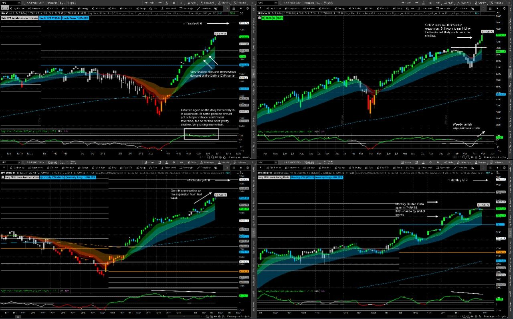

# Weekly Plan — Week of 2026-05-11

> Source: Saty Mahajan weekly note (paste here)
> SPX last close (note time): **TBD**

## TL;DR

- **Bias:** TBD
- **Macro week:** TBD
- **Key pivot:** TBD
- **Demand:** TBD / **Supply:** TBD
- **Divergences / setups in play:** TBD
- **Geopolitical/background:** TBD

---

## Key Levels (SPX)

| Level | Role | Notes |
|---|---:|---|
| TBD | TBD | TBD |

---

## Catalyst Calendar

| Day | Time (ET) | Event |
|---|---|---|
| Mon | | |
| Tue | | |
| Wed | | |
| Thu | | |
| Fri | | |

Calendars: [investing.com](https://investing.com/economic-calendar) · [forexfactory](https://forexfactory.com/calendar) · [marketwatch](https://www.marketwatch.com/economy-politics/calendar)

---

## Structural Read (Saty)

- **Long-term:** TBD
- **Weekly:** TBD
- **Daily:** TBD
- **Position/Quarterly:** TBD
- **Swing/Monthly:** TBD

<!-- Drop chart image here:  -->

---

## Game Plan by Scenario

### Bull case
- Setup conditions: TBD
- Setups to favor: Bilbo GG Bull (1h PO High+Rising), call-trigger 3m, GG entries (immediate / 1h EMA21).
- Avoid: TBD

### Bear case
- Setup conditions: TBD
- Setups to favor: Bilbo GG Bear (1h PO Low+Falling, 90.3% cohort), call-to-put-reversal, gg-invalidation as risk rule.
- Targets: TBD

### Chop case
- Setup conditions: TBD
- Setups to favor: Trigger Box directional (1hr hold confirmation), gg-chop-zone filter.
- Avoid: raw Bilbo Box breakouts; 0DTE entries inside ±30 min of major events.

---

## Event Risk Discipline

- No 0DTE held into FOMC / CPI / NFP — flat by event time minus 15 min.
- Earnings AH on individual names: SPX 0DTE only during regular session, closed by 3:55pm.
- Don't be long premium into pressers / known IV-crush events.

---

## Watchlist

- **SPX/SPY** — primary playbook
- TBD individual names with earnings or correlation risk
- **VIX** — pre-event behavior is the tell

---

## Reference

- Previous week's plan: TBD
- Master playbook: [`MASTER_TRADING_KNOWLEDGE.md`](../MASTER_TRADING_KNOWLEDGE.md)
- Editorial audit: [`audit-reruns/milkman_editorial_audit_2026-04-26.md`](../audit-reruns/milkman_editorial_audit_2026-04-26.md)
